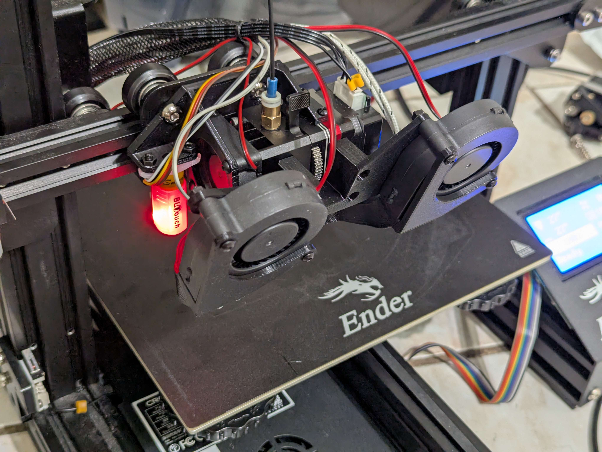
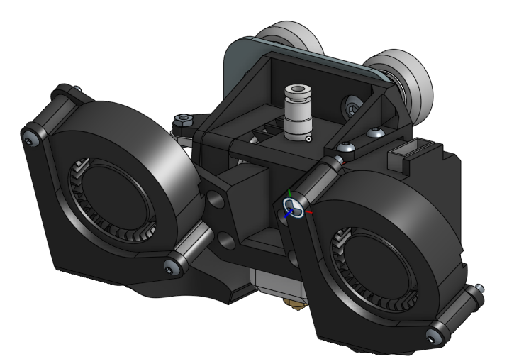
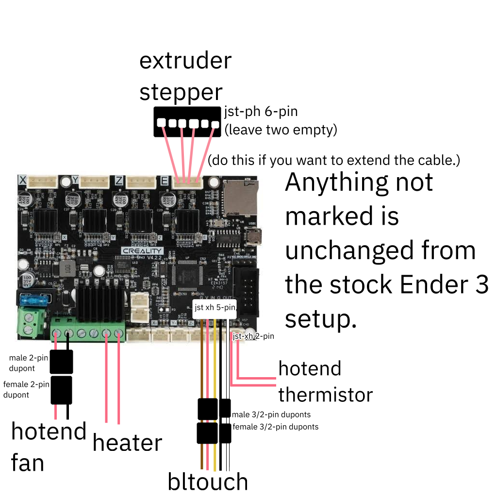
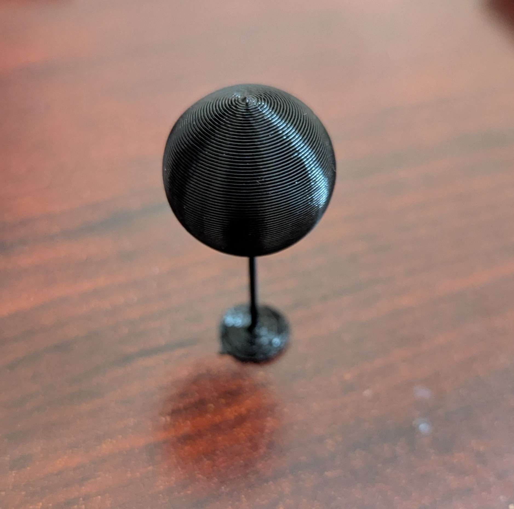
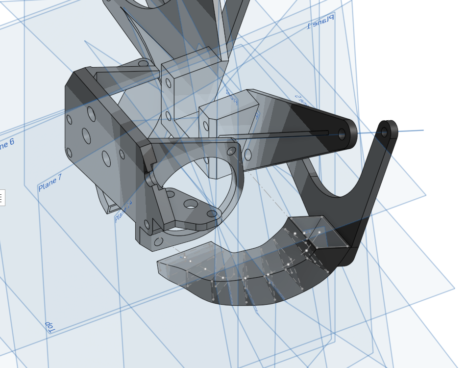

# Coolhead

[cad link](https://cad.onshape.com/documents/de9893fea101ddbb259c53bb/w/14a457677c58ecbb5b3d4857/e/d87e13b2c981aecff97c0c8d?renderMode=0&uiState=6a505e7716edb42ddf895db0)
[stardance link (it's just JOURNAL.md, I started here first and was too lazy to port)](https://stardance.hackclub.com/projects/19029)

I've been meaning to upgrade my Ender 3's printhead,
but then someone gave me a BIQU H2 V2S and BLTouch they weren't using,
so then I had to upgrade my printhead.

This mod replaces the stock extruder with the BIQU H2 V2S
and adds replaces the stock part cooling with two 5015 fans (I used the GDSTime models).

I wanted silicone wiring, so there's some custom wiring in my build.
You will need a crimper and wire strippers to make it.
Make sure your crimper is not too wide (I didn't).

Wiring diagram:

Here's a timelapse of this printhead printing the [pin-support challenge from fullcontrol.xyz](https://fullcontrol.xyz/#/models/67cf20) (click the image to open):

 
 
 
 
 
 

how i feel when onshape doesn't have 3d sketches

